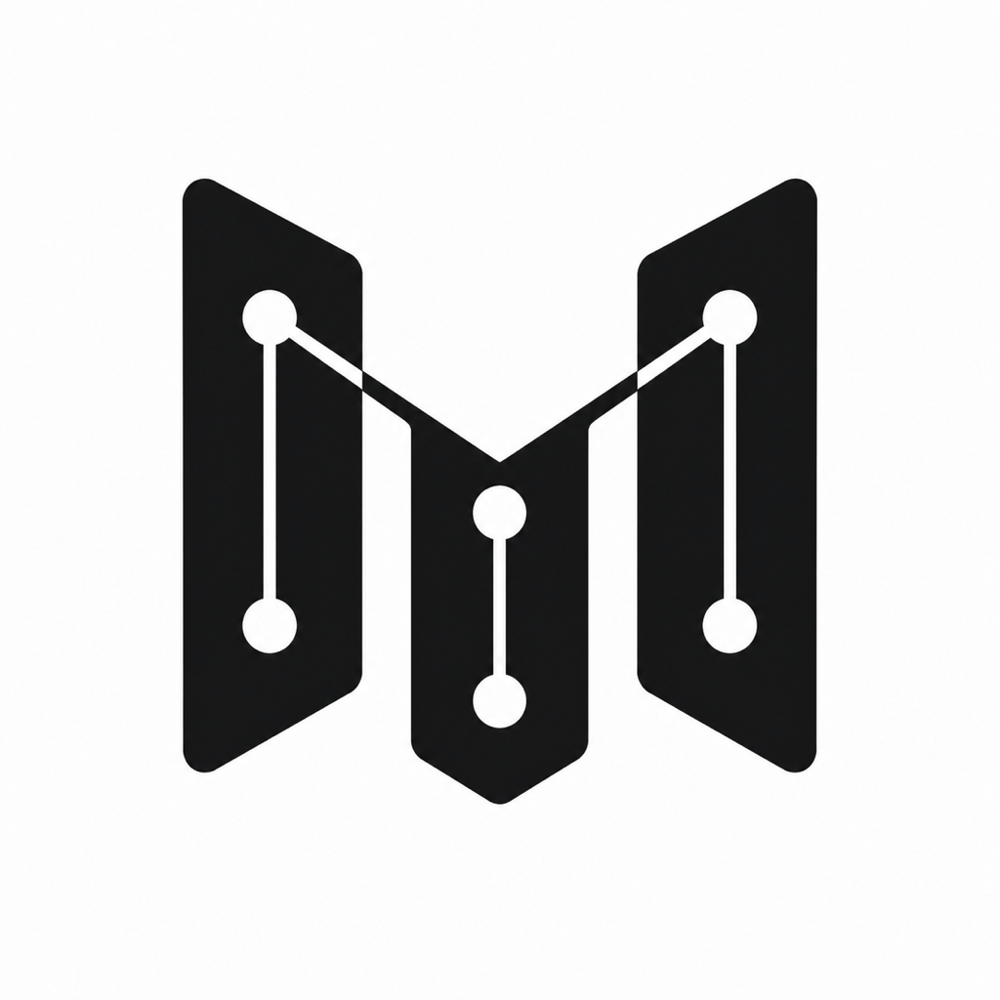
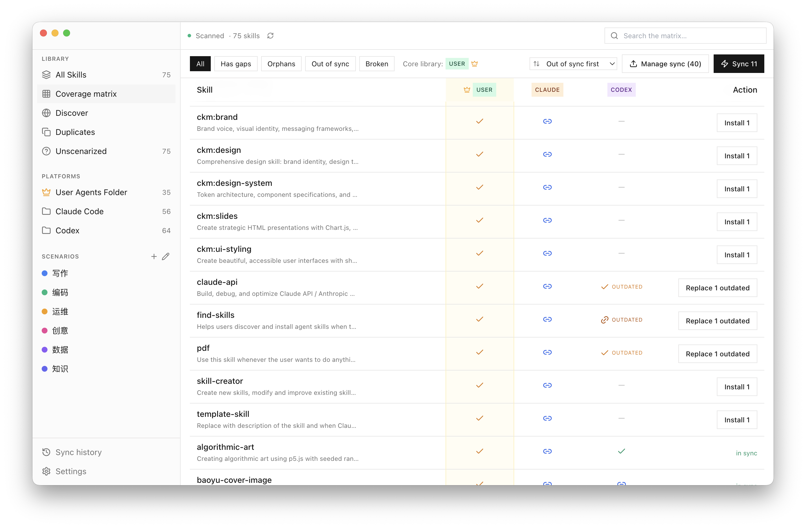
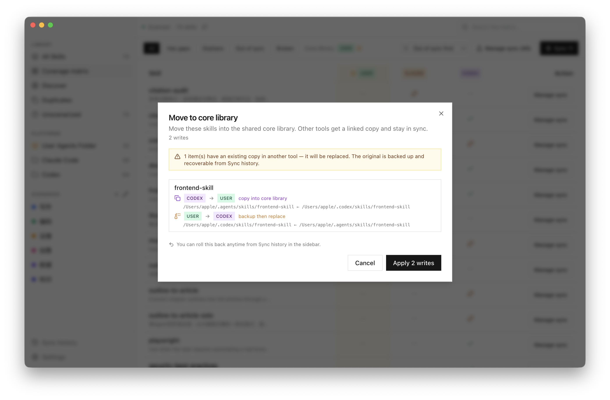
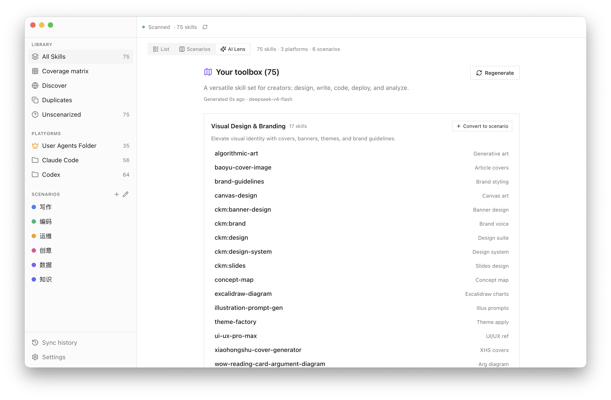

<p align="center">
  
</p>

<h1 align="center">MySkills</h1>

<p align="center">
  <em>One window for every AI agent skill.</em><br/>
  <sub>Claude Code · Codex · Shared pool · anything that reads <code>SKILL.md</code></sub>
</p>

<p align="center">
  <a href="https://github.com/Milktang0128/myskills/releases/latest">
    
  </a>
  
  <a href="LICENSE"></a>
</p>

<p align="center">
  <strong>English</strong> · <a href="README.zh.md">中文</a>
</p>

---

**MySkills is a local Mac app that scans `~/.claude/skills`, `~/.codex/skills`, and `~/.agents/skills`, deduplicates by name + source, and gives you one coherent view of every AI agent skill you have.**

A `SKILL.md` is a Markdown file with YAML frontmatter that tools like Claude Code and Codex load as reusable capabilities — prompts, tooling profiles, agent instructions. Once you use more than one of those tools, copies start to drift across folders. MySkills makes that mess legible without modifying any of your files.

<p align="center">
  
</p>

## Install

Download the signed, notarized DMG:

**[→ Releases page](https://github.com/Milktang0128/myskills/releases/latest)**

- **Apple Silicon Macs only** (M1, M2, M3, M4) — Intel build is on the roadmap
- **macOS 13 (Ventura) or later**
- DMG is ~116 MB; the installed app is ~280 MB
- Signed with a Developer ID certificate and stapled with Apple's notary ticket — open with a normal double-click, no Terminal workaround

## On your Mac

What MySkills puts where:

- `~/Library/Application Support/MySkills/myskills.db` — the SQLite database (scenarios, tags, scan results)
- `~/Library/Application Support/MySkills/backups/` — automatic backups before every sync write; retention is configurable in Settings
- macOS Keychain — your AI provider API keys, if you enable AI features

**Your `SKILL.md` files are never modified by MySkills.** Tags and scenarios live only in the database above.

> **iCloud caveat:** Don't put `~/.agents/` (your core library directory) inside iCloud Drive. iCloud can "evict" files and leave `.icloud` placeholders that show up as broken copies — keep the core library on a local path.

## What it does

### See your library in one place

- **List**, **Kanban** (by scenario), and **Coverage matrix** views. The matrix has one row per unique skill and one column per platform; cell colour shows which copies are in sync vs. out of sync
- Per-skill detail drawer with last-modified time, content hash, and resolved path on disk
- **Move to core library** to promote one platform's copy as the master; other platforms get a linked copy that stays in sync

### Sync writes are reviewable

- Every disk write goes through **Plan → Confirm → Execute**. A dialog shows you exactly what will change before anything happens
- Destructive operations write to `~/Library/Application Support/MySkills/backups/` first
- **One-click rollback** from Sync History
- Writes are atomic — temp directory + `rename`, no half-applied state

<p align="center">
  
</p>

### Discover and install from skills.sh

- Built-in search against [skills.sh](https://skills.sh) — a community catalog of `SKILL.md` skills; no account needed
- Preview the `SKILL.md` from GitHub raw before installing
- Install to any combination of platforms via the same plan-confirm-execute pipeline

### AI assist (optional, bring your own API key)

- Supports OpenAI / Anthropic / OpenRouter / DeepSeek / Ollama / any OpenAI-compatible endpoint
- **AI Lens** clusters your library into themes; you can promote any cluster into a real scenario in one click
- **Auto-categorize** new skills into scenarios you've defined
- **AI search** in Discover re-ranks catalog results against a natural-language need
- Each feature has its own toggle. Keys live in the macOS Keychain via Electron `safeStorage`

<p align="center">
  
</p>

## Privacy

- **All processing happens on your machine.** No telemetry, no analytics, no background phone-home
- The scanner only walks the folders you configure (default: `~/.claude/skills`, `~/.codex/skills`, `~/.agents/skills`)
- Network calls are limited to: skills.sh catalog search, and your chosen AI provider. Both are opt-in; both ship from your machine directly to the service — never via us
- Settings has a master **"Allow external network"** switch — turn it off and MySkills runs fully offline

## Build from source

```bash
npm install
npm run rebuild     # rebuild better-sqlite3 against Electron's ABI
npm run dev         # Next.js dev (:4477) + Electron concurrently
```

`npm run package` produces a signed DMG. Requires an Apple Developer ID certificate and an `xcrun notarytool` keychain profile (`myskills-notary` by default — see `scripts/notarize.cjs`).

**Requirements:** Node 22+, npm 10+, macOS 13+, Xcode Command Line Tools (for `better-sqlite3` native compilation).

## Architecture

Two TypeScript projects in one repo:

| Side | Path | Stack |
|---|---|---|
| Main process | `electron/` | Node 22, `better-sqlite3`, `electron-builder`, IPC via `contextBridge` |
| Renderer | `src/` | Next.js 15 (static export), React 19, Tailwind, shadcn/Radix |
| Contract | `shared/` | Plain TypeScript types and IPC channel constants — dependency-free |

The renderer runs sandboxed: `nodeIntegration: false`, `contextIsolation: true`, strict CSP, IPC sender validation. All filesystem and database work lives in the main process.

For deeper architecture see [**CLAUDE.md**](./CLAUDE.md) — the file is framed as an LLM coding-assistant brief, but the content is plain architecture notes worth reading. The full product spec is in [**SPEC.md**](./SPEC.md) (Chinese).

<details>
<summary><strong>How it works (internals)</strong></summary>

**Skill identity is the pair `(name, source_key)`.** `source_key` is `local` for now and will be a repo/marketplace slug for future imports. Content is fingerprinted by SHA-256 of `SKILL.md` — updating a skill bumps its `content_hash`, not its identity. Scenarios, tags, and any user state survive edits in place.

**Writes go through plan → confirm → execute:**

1. **Plan** is pure read: it walks the sources, classifies each cell (`in_sync` / `stale` / `only_here` / `missing`), computes diff hashes, and pre-allocates backup paths. Output is a typed `SyncPlan`.
2. **Confirm** shows you the plan, line by line.
3. **Execute** backs up first, writes to a temp dir, then atomically `rename`s into place.

Every successful write records `before_hash`, `after_hash`, `backup_path`, and the original `dry_run_plan` in `sync_history` — and is rollback-able.

</details>

## Roadmap

| Version | Theme | Status |
|---|---|---|
| **v0.1** | MVP-A — read-only inventory, scenarios, Discover, optional AI | shipping |
| v0.2 | MVP-B — sync writes (link / copy modes), enable/disable per location | partial (engine landed, UI gating) |
| v0.3+ | Project/plugin-level skill scanning, multi-machine awareness, Intel DMG | planned |

**Not planned:**
- In-app skill editor — use your usual editor on the realpath
- Cloud sync — MySkills stays local-only by design
- Windows / Linux ports — outside MVP scope

## Status

Solo personal project at v0.1.0. No automated test suite yet — verify changes by running the app. If you depend on MySkills for production work, pin to a release tag and watch the repo for updates.

## Contributing

Issues and PRs welcome. Before you open one:

1. **For non-trivial PRs, file an issue first.** MVP scope is intentionally tight, and the architecture has invariants — skill identity, plan→confirm→execute, the IPC boundary — that are easy to violate accidentally. The short list lives in [CLAUDE.md](./CLAUDE.md).
2. **Conventional commit style** (`feat:`, `fix:`, `ux:`, `docs:`, `chore:`). Match the existing log.
3. **No automated tests yet.** Don't claim "tests pass" — describe what you exercised manually in the PR description.

## Credits

- [skills.sh](https://skills.sh) — the catalog this app searches against, and the community of `SKILL.md` authors who made aggregation possible in the first place.
- Built with [Electron](https://electronjs.org/), [Next.js](https://nextjs.org/), [shadcn/ui](https://ui.shadcn.com/), and [Lucide](https://lucide.dev/).

## License

[MIT](LICENSE) © 2026 Milk Tang.
