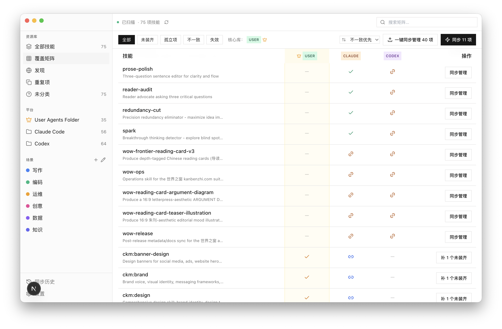
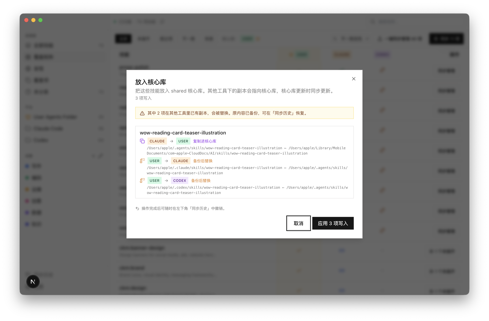
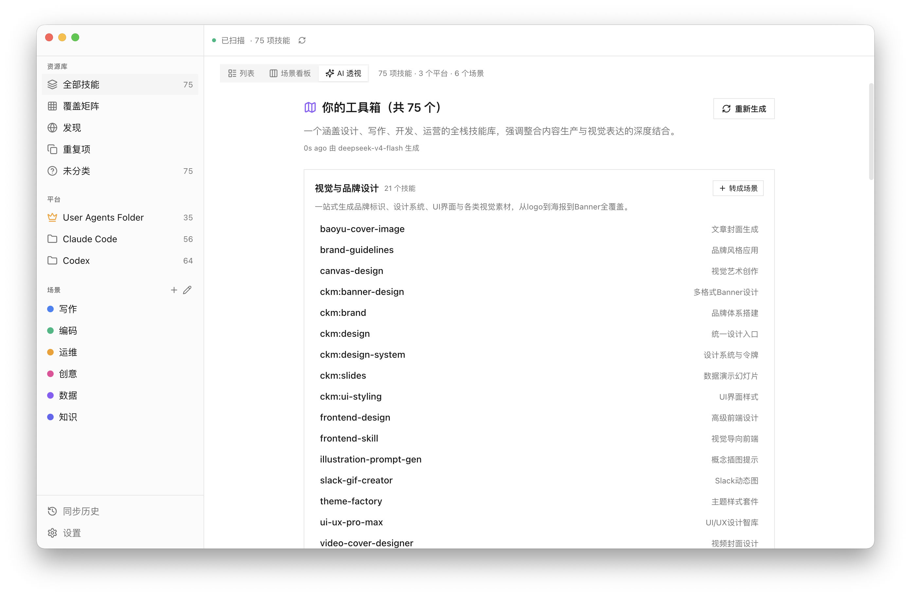

<p align="center">
  
</p>

<h1 align="center">MySkills</h1>

<p align="center">
  <em>一个窗口，管你所有 AI agent 技能。</em><br/>
  <sub>Claude Code · Codex · 共享池 · 任何读 <code>SKILL.md</code> 的工具</sub>
</p>

<p align="center">
  <a href="https://github.com/Milktang0128/myskills/releases/latest">
    
  </a>
  
  <a href="LICENSE"></a>
</p>

<p align="center">
  <a href="README.md">English</a> · <strong>中文</strong>
</p>

---

**MySkills 是一个本地桌面应用，扫描你登记的技能目录，按 name + source 去重，给你一个统一的视图。默认登记的是 `~/.claude/skills`、`~/.codex/skills`、`~/.agents/skills` 三个目录；可以在「设置」里增删平台或改路径。**

`SKILL.md` 是带 YAML frontmatter 的 Markdown 文件，Claude Code / Codex 这类工具会把它加载为可复用能力（提示词、工具配置、agent 指令）。同时用着多个这样的工具之后，副本就开始在各处漂移。MySkills 把这场混乱整理清楚；任何写入都必须显式确认、先备份、可回滚。

<p align="center">
  
</p>

## 安装

`v0.1.x` 是已冻结的 Electron/macOS 维护线。当前活跃的
`tauri/refactor-v0.2` 是 Tauri 2 重构线，使用独立 preview app id
（`com.kanbenzhi.myskills.tauri-preview`）和独立 app data 目录，直到 DB
迁移与回滚 parity 验证完成前都不复用 Electron 正式数据目录。

冻结的 Electron 版本可从 Releases 下载已签名、已公证的 macOS DMG：

**[→ Releases 页面](https://github.com/Milktang0128/myskills/releases/latest)**

- **仅支持 Apple Silicon Mac**（M1 / M2 / M3 / M4）—— Intel 版只在 Electron 维护线的路线图上
- **macOS 13 (Ventura) 或以上**
- DMG 约 116 MB；装好约 280 MB
- 用 Developer ID 证书签名，附 Apple 公证票据 —— 双击就能打开，不需要终端绕过

Tauri preview 分支请本地执行 `npm run build:tauri` 构建。公开的
macOS/Windows/Linux preview artifact 只有在功能 parity smoke 测试完成后才作为候选发布。

## 它在你桌面系统上的痕迹

MySkills 写入的位置：

- app data 目录里的 `myskills.db` —— SQLite 数据库（场景、标签、扫描结果）
- app data 目录里的 `backups/` 和 `staging/` —— 同步备份与安装暂存；保留策略在「设置」可调
- 系统凭据库 —— 你的 AI provider API key（启用 AI 功能时）

**你的 `SKILL.md` 文件 MySkills 一字不改。** 标签和场景只活在上面的数据库里。

> **iCloud 注意：** 不要把 `~/.agents/`（主源目录）放进 iCloud Drive。iCloud 可能"驱逐"文件、留下 `.icloud` 占位符，看起来会变成失效副本 —— 主源放在本地路径。

## 它能做什么

### 在一个地方看完你的库

- **列表**、**场景看板**（按场景分组）、**覆盖矩阵**（行 = 唯一技能，列 = 平台，单元格颜色显示哪些副本已同步、哪些不一致）
- 单技能详情抽屉显示最近修改时间、内容哈希、磁盘真实路径
- **纳入主源**：把某个平台的版本提升为主版本，其他平台的副本指向主源并自动同步

### 写入都可审查

- 每次磁盘写入都走 **Plan → Confirm → Execute**。对话框先告诉你**具体会改什么**，再开始
- 破坏性操作先备份到 app data 的 `backups/`
- **一键回滚**，在「同步历史」里
- 写入先经过临时路径，再替换目标；成功写入都会留下可回滚记录

<p align="center">
  
</p>

### 从 skills.sh 发现并安装

- 内置搜索对接 [skills.sh](https://skills.sh) —— 社区贡献的 `SKILL.md` 目录，免账号
- 安装前可预览 GitHub raw 上的 `SKILL.md`
- 可安装到任意几个平台组合，走同一条 plan-confirm-execute 流水线

### AI 辅助（可选，自带 API key）

- 支持 OpenAI / Anthropic / OpenRouter / DeepSeek / Ollama / 任意 OpenAI 兼容 baseURL
- **AI 透视** 把你的库聚类成主题，可一键把任何簇提升为正式场景
- **自动分类** 把新技能归到你定义的场景里
- **AI 搜索** 在 Discover 里按自然语言重排目录结果
- 每个功能独立开关。Key 保存在系统凭据库里。

<p align="center">
  
</p>

## 隐私

- **所有处理都在你机器上。** 无遥测、无埋点、无后台回家
- 扫描器只扫你配置的目录（默认：`~/.claude/skills`、`~/.codex/skills`、`~/.agents/skills`）
- 网络调用仅限：skills.sh 目录搜索、你选的 AI 提供商。两个都默认关闭，启用后请求从你的机器直接走到对应服务 —— 不经我们任何中转
- 设置里的「**允许外部网络**」总开关，关掉之后 MySkills 完全离线

## 从源码构建

```bash
npm install
npm run dev         # Tauri dev shell + Next.js dev (:4477)
npm run build       # Next.js 静态导出
npm run build:tauri # Tauri 桌面 bundle
```

冻结 Electron 线的命令保留在 `*:electron:legacy`。

**环境要求：** Node 22+、npm 10+、Rust/Cargo（rustup），以及对应平台的 Tauri 前置依赖。

## 架构

`v0.2` 线使用 Web 控制面 + Rust 后端：

| 侧 | 路径 | 技术栈 |
|---|---|---|
| Backend | `src-tauri/` | Tauri 2、Rust、`rusqlite`、自定义 commands |
| Renderer | `src/` | Next.js 15（静态导出）、React 19、Tailwind、shadcn/Radix |
| 契约 | `shared/` | 纯 TypeScript 类型和 command/channel 常量 —— 无任何依赖 |

Renderer 不拿直接文件系统、SQL、shell 或 HTTP 权限。所有文件系统、数据库、凭据与网络门控逻辑都在 MySkills 自定义 Tauri commands 后面。

深入架构看 [**CLAUDE.md**](./CLAUDE.md) —— 这个文件名义上是给 LLM 编程助手看的简报，但内容就是值得读的普通架构笔记。完整产品规格看 [**SPEC.md**](./SPEC.md)。

<details>
<summary><strong>内部工作机制</strong></summary>

**技能的身份由 `(name, source_key)` 这对组合决定。** `source_key` 目前是 `local`，未来会是仓库/市场的 slug。内容通过 `SKILL.md` 的 SHA-256 指纹标识 —— 技能更新只改 `content_hash`，不改身份。场景、标签和任何用户态都活在 DB 里，编辑技能时不丢。

**写入流水线 Plan → Confirm → Execute：**

1. **Plan** 纯只读：遍历来源，分类（`in_sync` / `stale` / `only_here` / `missing`），算 diff 哈希，预分配备份路径。输出是一个类型化的 `SyncPlan`。
2. **Confirm** 把 plan 一行行展示给你。
3. **Execute** 先备份，写入临时目录，最后原子 `rename` 到位。

每次成功的写入都记录 `before_hash`、`after_hash`、`backup_path`、原始 `dry_run_plan` 到 `sync_history` —— 都可回滚。

</details>

## 路线图

| 版本 | 主题 | 状态 |
|---|---|---|
| **v0.1** | MVP-A —— 只读库存、场景、Discover、可选 AI | 已发布 |
| v0.2 | Tauri 重构 —— 跨平台壳、Rust 后端、达到 Electron `v0.1.x` 功能 parity | 活跃 preview 分支 |
| v0.3+ | 项目/插件级技能扫描、多机感知、多平台签名发布自动化 | 计划中 |

**不会做的：**
- 应用内技能编辑器 —— 直接用你常用的编辑器改真实路径
- 云同步 —— MySkills 设计上就只跑在本地
- 在 MySkills 内运行 skill —— 执行仍交给各 agent 工具

## 当前状态

个人项目。`v0.1.x` 是冻结的 Electron/macOS 线；`v0.2` 是 Tauri 重构线。Rust 后端已有 migration 和 scanner 不变量的单测，但发布就绪仍需要对 Library、Coverage、Discover、Sync、History、Settings、AI flows 做桌面 smoke 测试。

## 贡献

欢迎 issue 和 PR。开 PR 前请注意：

1. **非小改动的 PR，请先开 issue。** MVP 范围有意保持窄，架构里有些不太显眼的不变量（技能身份、plan→confirm→execute、IPC 边界）很容易被无意识地破坏。短清单看 [CLAUDE.md](./CLAUDE.md)。
2. **遵守 Conventional Commits 风格**（`feat:`、`fix:`、`ux:`、`docs:`、`chore:`）。看历史记录就懂。
3. **目前没有自动测试。** 别在 PR 里说"测试通过"—— 在 PR 描述里写清楚你手动验证了什么。

## 致谢

- [skills.sh](https://skills.sh) —— 这个 app 搜索的目录来源，以及把 `SKILL.md` 格式规范化、让聚合成为可能的整个社区。
- 构建于 [Tauri](https://tauri.app/)、[Next.js](https://nextjs.org/)、[shadcn/ui](https://ui.shadcn.com/) 和 [Lucide](https://lucide.dev/) 之上。冻结的 `v0.1.x` 维护线使用 Electron。

## License

[MIT](LICENSE) © 2026 Milk Tang.
